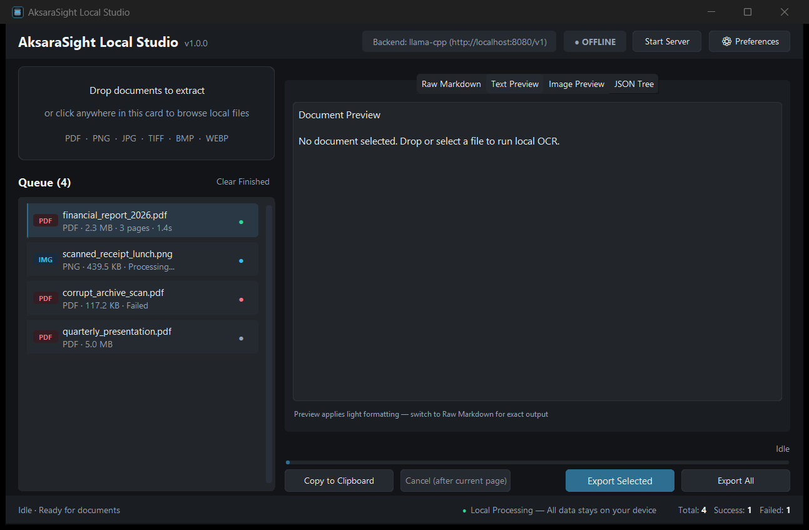

# AksaraSight

**AksaraSight** is a lightweight, 100% local OCR tool powered by GLM-OCR (0.9B parameters). Converts scanned documents, forms, receipts, and images into clean Markdown and structured JSON — entirely on your own machine.

No cloud APIs. No telemetry. If the local inference backend is unreachable, the tool fails with a clear error instead of quietly sending your documents anywhere.

---

### Project Maturity & Status
- **Feature-Complete for Current Scope**: All 5 core architectural phases complete (Core Pipeline, CLI Interface, Desktop GUI Studio, Live Backend Integration, Server Supervision). Tested locally across 361 automated unit and integration tests (note: multi-platform CI across heterogeneous GPU environments has not yet been established).
- **Extensively Audited**: Hardened across 7 rigorous audit cycles: Security (2 rounds), Performance, Code Quality (Ponytail simplification), Correctness & Data Integrity, Test Coverage Gaps, UX & Accessibility, and a dedicated Managed Runtime supply-chain security review.
- **Robust Test Suite**: 361 unit and integration tests passing with 100% pass rate.
- **Project History**: See [CHANGELOG.md](CHANGELOG.md) for the complete milestone evolution, audit breakdowns, and test history.

---

## Features

- **Strictly Local & Offline** — Interacts exclusively with a local OpenAI-compatible vision backend (`llama-server` or Ollama). Zero cloud fallback by design.
- **Zero-Setup Managed Runtime** — Automatically detects your hardware (NVIDIA CUDA 12.4+ / Vulkan / CPU), downloads the verified official `llama-server` release, cryptographically verifies SHA-256 digests for managed runtime binaries and libraries, and supervises server lifecycle. No manual llama.cpp compilation or installation required.
- **Dual Interfaces** — A scriptable CLI for automation and pipelines, and an engineering-grade Desktop GUI Studio with drag-and-drop ingestion and live split preview.
- **Batch Processing** — Ingest single files or entire directory trees recursively, with collision-safe artifact naming and background streaming exports.
- **4-Tab Live Previews** — Raw Markdown, rich formatted text, paginated original page rasters, and structured JSON trees.
- **Comprehensive Safety Rails** — Loopback-only endpoints enforced by default, PDF pixel-bomb protection, atomic temporary-file writes, and privacy-sanitized JSON paths.

## Requirements

- **OS**: Windows 10/11 (developed and tested on Windows with Python 3.14 / Tcl 9).
- **Python**: 3.10 or newer (3.14 recommended).
- **Hardware**:
  - *Recommended*: NVIDIA GPU (CUDA 12.4+, driver 550.54+) or Vulkan-capable discrete GPU for accelerated inference (~2.7s/page at 100 DPI on RTX 3050 Laptop GPU).
  - *Fallback*: CPU-only inference is supported automatically (slower throughput).

## Installation

```powershell
git clone <your-repo-url> AksaraSight
cd AksaraSight
python -m venv .venv
.\.venv\Scripts\Activate.ps1
pip install -r requirements.txt
```

## Quickstart

### 1. Desktop GUI Studio (Recommended — Zero-Setup)

The fastest way to get started. You do **not** need to install `llama-server` or configure CUDA manually:

1. **Launch the GUI**:
   ```powershell
   python -m gui
   ```

2. **Open Preferences**: Click the gear icon (`[⚙ Preferences]`) in the top right header.
3. **Download Runtime**:
   - Under *Local Inference Engine*, **Runtime Source** defaults to `Managed (Auto)`.
   - Your GPU/CPU architecture is automatically detected and displayed.
   - Click **Download Runtime**. The verified, pinned build of `llama-server` (and companion CUDA runtime libraries if applicable) will download, cryptographically verify archive digests against pinned SHA-256 hashes, and install to `%LOCALAPPDATA%\AksaraSight\runtimes\`.
4. **Start & Process**:
   - Click **Start Server** in the main header (status pill turns `● READY`).
   - Drag and drop documents or entire folders into the drop zone.
   - Inspect live transcriptions across the 4 preview tabs and click **Export All**.

---

### 2. Command-Line Interface (CLI)

The CLI supports single files, piping, and recursive batch directory processing:

```powershell
# Detect hardware and check recommended backend
python -m cli.main --detect-hardware

# Process a single document and stream Markdown to stdout
python -m cli.main document.png

# Pipe clean Markdown output directly to a file or tool (suppressing logs)
python -m cli.main document.pdf --quiet > output.md

# Batch process a directory recursively, exporting both .md and .json artifacts
python -m cli.main .\scans\ -o .\output\ -f both --recursive

# Process with custom resolution and page cap
python -m cli.main invoice.pdf -o .\output\ --dpi 150 --max-pages 5
```

---

### 3. Custom Runtime / Manual Server (Optional)

If you already have a running `llama-server`, Ollama, or vLLM instance:

1. **Launch your server** with GLM-OCR GGUF weights:
   ```powershell
   # Option A: Automatic Hugging Face resolution (llama.cpp b10930+ auto-downloads matching mmproj)
   llama-server -hf ggml-org/GLM-OCR-GGUF --port 8080 -ngl 99 -c 8192 --parallel 1

   # Option B: Local GGUF files (explicit --mmproj is REQUIRED for vision/OCR; --flash-attn off recommended for broader compatibility)
   llama-server -m path/to/GLM-OCR-Q8_0.gguf --mmproj path/to/mmproj-GLM-OCR-Q8_0.gguf --port 8080 -ngl 99 -c 8192 --parallel 1 --flash-attn off
   ```
2. **Point the tool to your server**:
   - In GUI: In **Preferences**, switch **Runtime Source** to `Custom Path` and set your `llama-server.exe` path or leave empty if managing externally.
   - In `.env`:
     ```env
     OCR_RUNTIME_MODE=custom
     OCR_ENDPOINT=http://localhost:8080/v1
     ```

## Desktop GUI Studio



- **Header Controls** — Live server status indicator (`● READY`, `● STARTING`, `● OFFLINE`, `● ERROR`), one-click Start/Stop server toggle, and Preferences launcher.
- **Drop Zone** — Drag and drop individual files or nested directory trees (asynchronous discovery); click to open native file browser.
- **Queue Manager** — Real-time per-document status dots, format chips, precomputed file sizes, processed DPI tracking, and execution timers. Supports cooperative inter-page cancellation (`Cancel (after current page)`).
- **Split Preview Pane** — 4 synchronized tabs:
  - *Raw Markdown*: Direct transcription text.
  - *Text Preview*: Formatted typography preview with tag handling and disclaimer note.
  - *Image Preview*: Paginated raster of original document pages loaded on-demand.
  - *JSON Tree*: Structured document metadata, timing benchmarks, and per-page status.
- **Action Bar & Footer** — Copy to Clipboard, Export Selected, background multi-threaded Export All with progress reporting, Clear Finished, and on-device privacy guarantee.

## CLI Reference

```
python -m cli.main [input] [options]
```

| Flag | Description | Default |
| --- | --- | --- |
| `input` | Path to file or directory to process. | *Required* |
| `-o, --output` | Output directory. Required when `input` is a directory; omit for stdout. | `None` |
| `-f, --format` | Export format: `markdown`, `json`, or `both`. | `markdown` |
| `-p, --prompt-mode` | Transcription preset: `text`, `table`, or `formula`. | `text` |
| `--prompt` | Custom model instruction prompt (overrides preset). | `None` |
| `-r, --recursive` | Recursively scan subdirectories for documents. | `False` |
| `--detect-hardware` | Probe system hardware, print recommended backend, and exit. | `False` |
| `--backend` | Inference backend: `llama-cpp`, `ollama`, or `vllm`. | `llama-cpp` |
| `--endpoint` | OpenAI-compatible API base URL. | `http://localhost:8080/v1` |
| `--allow-remote` | Explicitly permit non-loopback endpoints (see Security). | `False` |
| `--max-pages` | Maximum pages to process per document. | `None` (unlimited) |
| `--dpi` | PDF rasterization DPI (higher = clearer text, higher latency). | `100` |
| `-q, --quiet` | Suppress log messages; emit strictly transcription output. | `False` |

**Supported Input Formats:** `.png`, `.jpg`, `.jpeg`, `.tiff`, `.tif`, `.bmp`, `.webp`, `.pdf`.

**Exit Codes:** `0` Success (all documents processed) · `1` Fatal error / offline abort · `2` Partial failure (some documents failed).

## Configuration

Settings are loaded from environment variables or a `.env` file. The canonical `OCR_`-prefixed variable names are recommended (legacy unprefixed names remain supported with a deprecation notice).

| Variable | Default | Description |
| --- | --- | --- |
| `OCR_RUNTIME_MODE` | `managed` | `managed` (auto-detect and supervise) or `custom` (manual path/external). |
| `OCR_MANAGED_BACKEND_OVERRIDE` | `auto` | Force managed backend: `auto`, `cuda`, `vulkan`, or `cpu`. |
| `OCR_LLAMA_SERVER_PATH` | — | Path to `llama-server.exe` when in `custom` mode. |
| `OCR_MODEL_REPO` | `ggml-org/GLM-OCR-GGUF` | Hugging Face repository for GGUF model weights. |
| `OCR_AUTO_START_SERVER` | `false` | Automatically start the managed server when the GUI launches. |
| `OCR_BACKEND` | `llama-cpp` | Inference engine type: `llama-cpp`, `ollama`, or `vllm`. |
| `OCR_ENDPOINT` | `http://localhost:8080/v1` | Local OpenAI-compatible API endpoint URL. |
| `OCR_TIMEOUT` | `60.0` | Network request timeout in seconds. |
| `OCR_MAX_RETRIES` | `2` | Retry attempts on transient network or 5xx/429 errors. |
| `OCR_ALLOW_REMOTE` | `false` | Opt-in to permit non-loopback endpoints. |
| `OCR_DPI` | `100` | Rasterization DPI for PDF pages. |
| `OCR_MAX_PAGES` | — | Global page cap per document (`None` = all pages). |
| `OCR_MAX_IMAGE_DIMENSION` | `2048` | Longest-edge dimension cap (512–8192 px) to protect VRAM. |

A documented template is available in `.env.example`.

## Security & Privacy

- **Enforced Loopback by Default**: Outbound HTTP traffic is restricted strictly to loopback addresses (`localhost`, `127.0.0.1`, `::1`). Binding or connecting to remote IP addresses requires explicit opt-in (`--allow-remote` / `OCR_ALLOW_REMOTE=true`), and both CLI and GUI display prominent visual warnings when remote mode is active.
- **Zero Cloud Fallback**: If the local backend process crashes or is unreachable, processing fails immediately with a clear error. Documents are never routed externally.
- **Verified Supply-Chain Delivery**: Managed runtime binaries and companion shared libraries (e.g. `llama-server.exe`, `cudart*.dll`) are downloaded exclusively from official GitHub release assets over HTTPS, validated against pinned SHA-256 cryptographic digests, protected against Zip-Slip path traversals during extraction, and executed with explicit CWD isolation. (Note: GGUF model weights are downloaded via llama.cpp's built-in Hugging Face downloader and are not currently pinned or hash-verified by this application.)
- **Win32 Job Object Supervision**: On Windows, the managed `llama-server` process is assigned to a Win32 Job Object configured with `JOB_OBJECT_LIMIT_KILL_ON_JOB_CLOSE (0x2000)`. Even if the GUI terminates abruptly or crashes, the OS kernel guarantees the server subprocess is terminated immediately, preventing orphaned background processes.
- **Decompression-Bomb & Pixel-Bomb Defense**: Ingested images and PDF pages undergo dimension preflight validation before rasterization (`MAX_RASTER_PIXELS = 89,478,485 px`), preventing memory-exhaustion denial-of-service attacks.
- **Atomic File Writing & Path Privacy**: Artifact writes utilize atomic temporary file replacement (`.tmp` + rename). Exported JSON metadata automatically relativizes local paths against the working directory or home folder to prevent leaking usernames in shared artifacts.

## Output Formats

- **Markdown (`.md`)**: Full text transcription preserving document hierarchy, headers, lists, tables, and mathematical formulas.
- **JSON (`.json`)**: Structured document payload containing document metadata, per-page transcriptions, page statuses, execution durations, processed DPI, and token usage summaries.

## Known Limitations

- **GLM-OCR Currency Symbol Omission (`$`)**: When currency amounts lack whitespace (e.g., `$100.00` or `$1,250.00`), the GLM-OCR tokenizer interprets `$` directly preceding digits as an unclosed inline LaTeX math delimiter, causing post-processing filters to strip the symbol (e.g., outputting `.00`). Amounts with whitespace (`$ 100.00`) or currency codes (`USD 100.00`) transcribe accurately. Always verify currency symbols in financial documents.
- **Resolution vs. Latency Balance**: 100 DPI provides an optimal balance (~2.7s/page on RTX 3050 Laptop GPU, ~1.7 MP) with 100% character fidelity on our synthetic dense-text benchmark contract. Real-world accuracy varies depending on document layout complexity, scan degradation, lighting, resolution, and language. 150 DPI (~3.8 MP) roughly doubles inference latency, while 72 DPI can degrade fine print.
- **Cooperative Cancellation**: In-flight HTTP vision inference requests cannot be aborted mid-packet without corrupting the connection pool; cancellation requests are evaluated cooperatively at document page boundaries, preserving partial work completed up to that point.

## Testing & Development

Run the full automated unit, integration, and smoke test suite:

```powershell
# Run the automated test suite
python -m pytest

# Run GUI smoke test
python scripts/smoke_test_gui.py
```

### Architecture Layout

| Directory | Purpose |
| --- | --- |
| `core/` | Ingestion pipeline, OpenAI vision client, OCR engine, artifact formatter, hardware detection, managed runtime manager, and server lifecycle supervisor. |
| `cli/` | Command-line interface with streaming output, batch processing, and exit code routing. |
| `gui/` | CustomTkinter desktop studio (`app.py`, `settings_window.py`, `theme.py`). |
| `config/` | Immutable, validated `Settings` dataclass with comment-preserving `.env` persistence. |
| `scripts/` | Benchmark harnesses, screenshot generation utilities, and headless smoke tests. |
| `tests/` | 361 unit and integration tests covering all modules and failure modes. |

## License

The source code of AksaraSight is licensed under the [MIT License](LICENSE).

Model weights (`ggml-org/GLM-OCR-GGUF`) are created by upstream publishers and governed by their respective model licenses.
