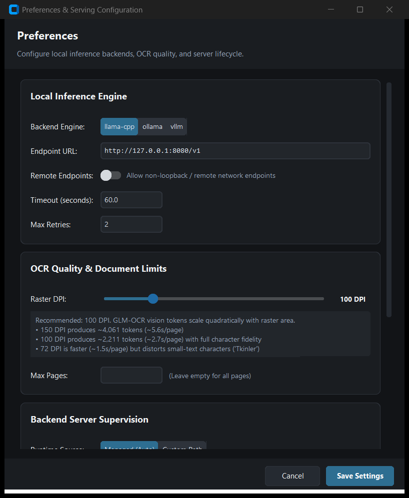
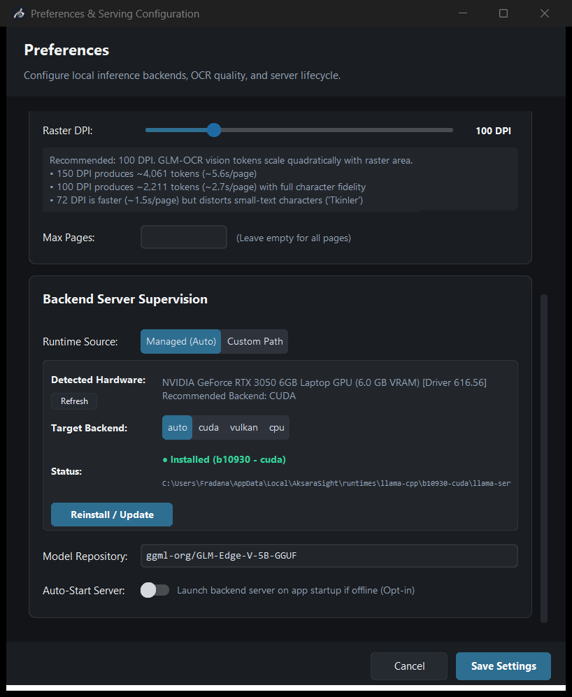
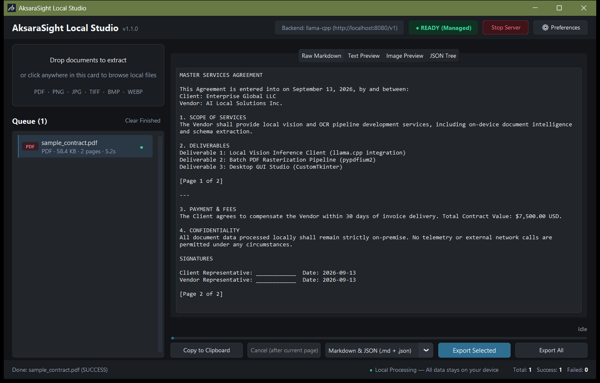
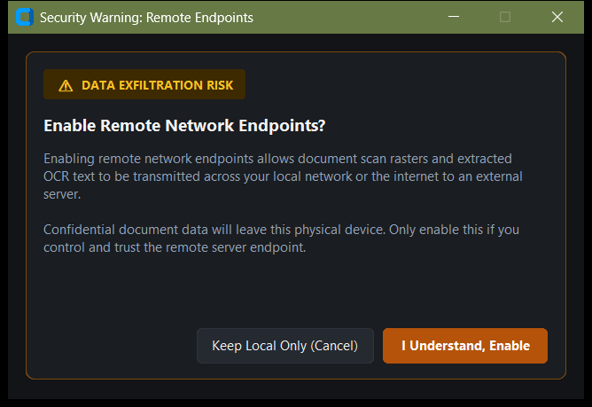

# AksaraSight

**AksaraSight** is a lightweight, 100% local OCR tool powered by GLM-OCR (0.9B parameters). Converts scanned documents, forms, receipts, and images into clean Markdown, formatted Word documents (.docx), and structured JSON — entirely on your own machine.

No cloud APIs. No telemetry. If the local inference backend is unreachable, the tool fails with a clear error instead of quietly sending your documents anywhere.


---

### Project Maturity & Status
- **Feature-Complete for Current Scope**: Core pipeline, CLI, and Desktop GUI Studio are complete, with live local backend integration and full server lifecycle supervision.
- **Robust Test Suite**: 403 unit and integration tests passing with 100% pass rate (note: multi-platform CI across heterogeneous GPU environments has not yet been established).
- **Project History**: See [CHANGELOG.md](CHANGELOG.md) for the complete milestone evolution, audit breakdowns, and test history.

---

## Features

- **100% local inference.** Connects strictly to a local OpenAI-compatible vision backend (`llama-server` or Ollama). There is no cloud fallback — if the local model isn't running, it fails with a clear error instead of phoning home.
- **Zero-setup runtime.** Automatically detects your hardware (NVIDIA CUDA 12.4+, Vulkan, or CPU) and downloads the matching official `llama-server` build. Binaries and companion libraries are cryptographically verified against pinned SHA-256 hashes before they run.
- **Two ways to work.** Use the scriptable CLI in terminal pipelines, or launch the desktop GUI studio for drag-and-drop ingestion and live inspection.
- **Single files or full trees.** Process individual scans or recursively walk nested folders. Exports run in the background with collision-safe file naming so nothing gets overwritten.
- **Four live preview tabs.** Inspect raw Markdown, rich rendered text, paginated rasters of the original pages, or structured JSON trees.
- **Safe defaults.** Connections are restricted to loopback addresses (`127.0.0.1`) out of the box. Includes PDF pixel-bomb dimension guards, atomic temporary-file writes, and path sanitization in exported JSON.

## Requirements

- **OS**: Windows 10/11 (developed and tested on Windows with Python 3.14 / Tcl 9).
- **Python**: 3.10 or newer (3.14 recommended).
- **Hardware**:
  - *Recommended*: NVIDIA GPU (CUDA 12.4+, driver 550.54+) or Vulkan-capable discrete GPU for accelerated inference (~2.7s/page at 100 DPI on RTX 3050 Laptop GPU).
  - *Fallback*: CPU-only inference is supported automatically (slower throughput).

## Installation

```powershell
git clone https://github.com/afif25fradana/AksaraSight
cd AksaraSight
python -m venv .venv
.\.venv\Scripts\Activate.ps1
pip install -r requirements.txt
```

## Quickstart

### 1. Desktop GUI Studio (Recommended — Zero-Setup)

The quickest way to get started. You don't need to install `llama-server` or configure CUDA beforehand:

1. **Launch the GUI**:
   ```powershell
   python -m gui
   ```

2. **Open Preferences**: Click **[⚙ Preferences]** in the top-right header.
3. **Download Runtime**:
   - Under *Local Inference Engine*, **Runtime Source** defaults to `Managed (Auto)`.
   - Your hardware is detected automatically.
   - Click **Download Runtime**. It downloads the verified `llama-server` build for your machine (along with CUDA runtime libraries if on an NVIDIA GPU), verifies the archive against pinned SHA-256 hashes, and extracts it to `%LOCALAPPDATA%\AksaraSight\runtimes\`.

   <p align="center">
     
     
   </p>

4. **Start & Process**:
   - Click **Start Server** in the header. Once initialized, the indicator turns `● READY`.
   - Drop files or whole folders into the drop zone.
   - Review results across the 4 tabs and click **Export All** when done.

---

### 2. Command-Line Interface (CLI)

Run single documents, pipe output to other tools, or batch process full directories:

```powershell
# Detect hardware and check recommended backend
python -m cli.main --detect-hardware

# Run a full diagnostic checklist (config, hardware, runtime, server, vision probe)
python -m cli.main --doctor

# Process a single document and stream Markdown to stdout
python -m cli.main document.png

# Pipe clean Markdown output directly to a file or tool (suppressing logs)
python -m cli.main document.pdf --quiet > output.md

# Batch process a directory recursively, exporting both .md and .json artifacts
python -m cli.main .\scans\ -o .\output\ -f both --recursive

# Process with custom resolution and page cap
python -m cli.main invoice.pdf -o .\output\ --dpi 150 --max-pages 5
```

---

### 3. Custom Runtime / Manual Server (Optional)

If you already run your own `llama-server`, Ollama, or vLLM instance:

1. **Launch your server** with GLM-OCR GGUF weights:
   ```powershell
   # Option A: Automatic Hugging Face resolution (llama.cpp b10930+ auto-downloads matching mmproj)
   llama-server -hf ggml-org/GLM-OCR-GGUF --port 8080 -ngl 99 -c 8192 --parallel 1

   # Option B: Local GGUF files (explicit --mmproj is REQUIRED for vision/OCR; --flash-attn off recommended for broader compatibility)
   llama-server -m path/to/GLM-OCR-Q8_0.gguf --mmproj path/to/mmproj-GLM-OCR-Q8_0.gguf --port 8080 -ngl 99 -c 8192 --parallel 1 --flash-attn off
   ```
2. **Point the tool to your server**:
   - In the GUI: Open **Preferences**, change **Runtime Source** to `Custom Path`, and enter your `llama-server.exe` path (or leave it blank if the process is already running outside AksaraSight).
   - In `.env`:
     ```env
     OCR_RUNTIME_MODE=custom
     OCR_ENDPOINT=http://localhost:8080/v1
     ```

## Desktop GUI Studio



- **Header controls.** Monitor server state (`● READY`, `● STARTING`, `● OFFLINE`, `● ERROR`), start or stop the backend with one click, and access the Preferences modal.
- **Drop zone.** Drag in individual scans or entire folder hierarchies for asynchronous discovery. You can also click anywhere in the card to open a standard file browser.
- **Queue manager.** Tracks each document with live status dots, format chips, file sizes, and elapsed run timers. If global DPI changes later, an indicator marks items processed at earlier resolutions. Long jobs can be stopped gracefully between pages with `Cancel (after current page)`.
- **Split preview pane.** Four synchronized views let you verify output from different angles:
  - *Raw Markdown*: Exact transcription text emitted by the model.
  - *Text Preview*: Formatted typography preview with tag handling (headings, tables, code) and a disclaimer note pointing to Raw Markdown for exact output.
  - *Image Preview*: Paginated original page rasters, rendered on demand to conserve RAM.
  - *JSON Tree*: Structured metadata, per-page latency benchmarks, and status logs.
- **Action bar & footer.** Copy Markdown directly, export selected documents, or trigger a multi-threaded batch export with live progress reporting. Also includes a "Clear Finished" queue cleanup button and a persistent footer with on-device privacy guarantees.

## CLI Reference

```
python -m cli.main [input] [options]
```

| Flag | Description | Default |
| --- | --- | --- |
| `input` | Path to file or directory to process. | *Required* |
| `-o, --output` | Output directory. Required when `input` is a directory; omit for stdout. | `None` |
| `-f, --format` | Export format: `markdown`, `json`, `both`, or `docx`. | `markdown` |
| `-p, --prompt-mode` | Transcription preset: `text`, `table`, or `formula`. | `text` |
| `--prompt` | Custom model instruction prompt (overrides preset). | `None` |
| `-r, --recursive` | Recursively scan subdirectories for documents. | `False` |
| `--detect-hardware` | Probe system hardware, print recommended backend, and exit. | `False` |
| `--doctor` | Run a diagnostic checklist (configuration, hardware, runtime installation, server reachability, multimodal vision probe) and exit. | `False` |
| `--backend` | Inference backend: `llama-cpp`, `ollama`, or `vllm`. | `llama-cpp` |
| `--endpoint` | OpenAI-compatible API base URL. | `http://localhost:8080/v1` |
| `--allow-remote` | Explicitly permit non-loopback endpoints (see Security). | `False` |
| `--max-pages` | Maximum pages to process per document. | `None` (unlimited) |
| `--dpi` | PDF rasterization DPI (higher = clearer text, higher latency). | `100` |
| `-q, --quiet` | Suppress log messages; emit strictly transcription output. | `False` |

**Supported Input Formats:** `.png`, `.jpg`, `.jpeg`, `.tiff`, `.tif`, `.bmp`, `.webp`, `.pdf`.

**Exit Codes:** `0` Success (all documents processed) · `1` Fatal error / offline abort · `2` Partial failure (some documents failed).

## Configuration

Settings are loaded from environment variables or a `.env` file. The canonical `OCR_`-prefixed variable names are recommended (legacy unprefixed names remain supported with a deprecation notice).

| Variable | Default | Description |
| --- | --- | --- |
| `OCR_RUNTIME_MODE` | `managed` | `managed` (auto-detect and supervise) or `custom` (manual path/external). |
| `OCR_MANAGED_BACKEND_OVERRIDE` | `auto` | Force managed backend: `auto`, `cuda`, `vulkan`, or `cpu`. |
| `OCR_LLAMA_SERVER_PATH` | — | Path to `llama-server.exe` when in `custom` mode. |
| `OCR_MODEL_REPO` | `ggml-org/GLM-OCR-GGUF` | Hugging Face repository for GGUF model weights. |
| `OCR_AUTO_START_SERVER` | `false` | Automatically start the managed server when the GUI launches. |
| `OCR_BACKEND` | `llama-cpp` | Inference engine type: `llama-cpp`, `ollama`, or `vllm`. |
| `OCR_ENDPOINT` | `http://localhost:8080/v1` | Local OpenAI-compatible API endpoint URL. |
| `OCR_TIMEOUT` | `60.0` | Network request timeout in seconds. |
| `OCR_MAX_RETRIES` | `2` | Retry attempts on transient network or 5xx/429 errors. |
| `OCR_ALLOW_REMOTE` | `false` | Opt-in to permit non-loopback endpoints. |
| `OCR_DPI` | `100` | Rasterization DPI for PDF pages. |
| `OCR_MAX_PAGES` | — | Global page cap per document (`None` = all pages). |
| `OCR_MAX_IMAGE_DIMENSION` | `2048` | Longest-edge dimension cap (512–8192 px) to protect VRAM. |

A documented template is available in `.env.example`.

## Security & Privacy

- **Loopback by default.** Outbound connections are restricted strictly to loopback addresses (`localhost`, `127.0.0.1`, `::1`). Connecting to a remote endpoint requires explicit opt-in (`--allow-remote` or `OCR_ALLOW_REMOTE=true`), and both the CLI and GUI warn loudly when remote mode is enabled.

  <p align="center">
    
  </p>

- **No cloud fallback.** If the local backend crashes or goes offline, processing stops immediately with a clear error. Documents are never routed out to an external service.
- **Verified runtime downloads.** In managed mode, `llama-server.exe` and companion libraries (like `cudart*.dll`) are downloaded directly from official GitHub release assets over HTTPS, checked against pinned SHA-256 hashes before extraction, protected against Zip-Slip path traversal, and executed with isolated working directories. (Note: GGUF model weights are fetched by llama.cpp's built-in Hugging Face downloader and are not currently pinned or hash-verified by AksaraSight.)
- **Clean process lifecycle.** On Windows, the managed `llama-server` process runs inside a Win32 Job Object with `JOB_OBJECT_LIMIT_KILL_ON_JOB_CLOSE (0x2000)`. Even if the GUI crashes or is killed abruptly, the operating system kernel closes the server process immediately so no orphaned instances linger in the background.
- **Pixel-bomb protection.** Oversized images and PDFs are rejected before rasterization — any page over 89,478,485 pixels (`MAX_RASTER_PIXELS`) is blocked so malicious or corrupted files cannot exhaust memory.
- **Atomic writes and path privacy.** File exports write to temporary files (`.tmp`) first and rename them into place atomically, so partial writes never corrupt existing files. Exported JSON paths are automatically relativized against the working directory or user home folder to avoid leaking local usernames.

## Output Formats

- **Markdown (`.md`)**: Full text transcription preserving document hierarchy, headers, lists, tables, and mathematical formulas.
- **JSON (`.json`)**: Structured document payload containing document metadata, per-page transcriptions, page statuses, execution durations, processed DPI, and token usage summaries.
- **Word Document (`.docx`)**: Formatted Microsoft Word document with headings mapped to Word styles (`Heading 1–3`), GFM pipe tables with repeating headers across page splits (`w:tblHeader`) and row-split prevention (`w:cantSplit`), monospace code blocks, and page breaks inserted strictly between scanned pages.

## Known Limitations

- **Missing currency symbols (`$`) without spaces.** When currency figures lack spaces (like `$100.00` or `$1,250.00`), GLM-OCR's tokenizer treats the `$` before digits as an unclosed inline LaTeX math delimiter, and the post-processing filter strips the symbol (producing `.00` or `,250.00`). Figures with spaces (`$ 100.00`) or ISO codes (`USD 100.00`) transcribe normally. Check financial scans manually for missing dollar signs.
- **DPI and speed trade-offs.** The default 100 DPI (~1.7 MP) takes roughly ~2.7s per page on an RTX 3050 Laptop GPU and hits 100% character accuracy on our synthetic dense-text benchmark document. Stepping up to 150 DPI (~3.8 MP) roughly doubles processing time, while dropping to 72 DPI can blur fine print. Real-world accuracy depends on scan quality, lighting, and layout complexity.
- **Page-boundary cancellation.** An active HTTP vision request cannot be safely aborted mid-transfer without tearing down the connection pool. When you cancel a multi-page job, the engine stops as soon as the current page finishes, saving whatever pages completed before the cancel.

## Testing & Development

Run the automated test suite:

```powershell
# Fast subset (no GUI, ~5s)
pytest --ignore=tests/test_gui.py

# Full suite (~85s, requires a display)
pytest

# Run GUI smoke test
python scripts/smoke_test_gui.py
```

### Verification Scripts

For contributors building the standalone portable distribution (`python scripts/build_portable.py`), empirical verification scripts in `scripts/` validate the packaged binaries in `dist/AksaraSight/`:

- **`python scripts/verify_frozen_build.py`**: Asserts CLI binary version output (`--version`), zero-network hardware detection report (`--detect-hardware`), input validation failure handling (exit code 1 on missing files), real OS window table visibility and rendering via Win32 API (`EnumWindows`, `IsWindowVisible`, `GetWindowTextW`) followed by clean `WM_CLOSE`, and startup logging in `%LOCALAPPDATA%\AksaraSight\logs\app.log`.
- **`python scripts/verify_frozen_docx.py`**: Asserts bundling of `docx/templates/default.docx` in `_internal`, verifies frozen CLI DOCX export against a local loopback mock OCR server, validates OOXML document structure and GFM table XML attributes (`w:tblHeader`, `w:cantSplit`), verifies binary stdout redirection, and performs a 100% source vs. frozen text and table cell parity diff.

### Architecture Layout

| Directory | Purpose |
| --- | --- |
| `core/` | Ingestion pipeline, OpenAI vision client, OCR engine, artifact formatter, hardware detection, managed runtime manager, and server lifecycle supervisor. |
| `cli/` | Command-line interface with streaming output, batch processing, and exit code routing. |
| `gui/` | CustomTkinter desktop studio (`app.py`, `settings_window.py`, `theme.py`). |
| `config/` | Immutable, validated `Settings` dataclass with comment-preserving `.env` persistence. |
| `scripts/` | Benchmark harnesses, screenshot generation utilities, and headless smoke tests. |
| `tests/` | 403 unit and integration tests covering all modules and failure modes. |

## License

The source code of AksaraSight is licensed under the [MIT License](LICENSE).

Model weights (`ggml-org/GLM-OCR-GGUF`) are created by upstream publishers and governed by their respective model licenses.