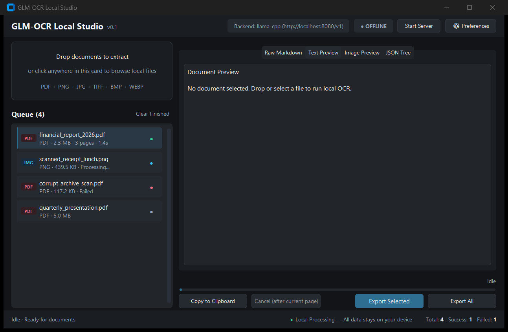
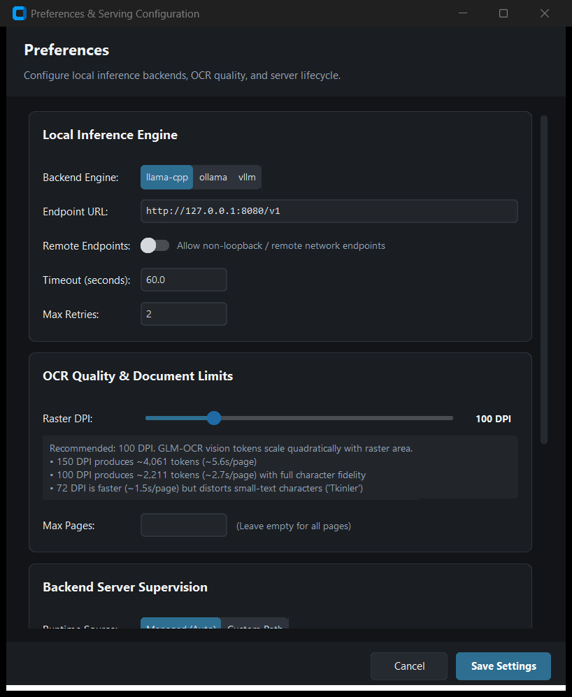
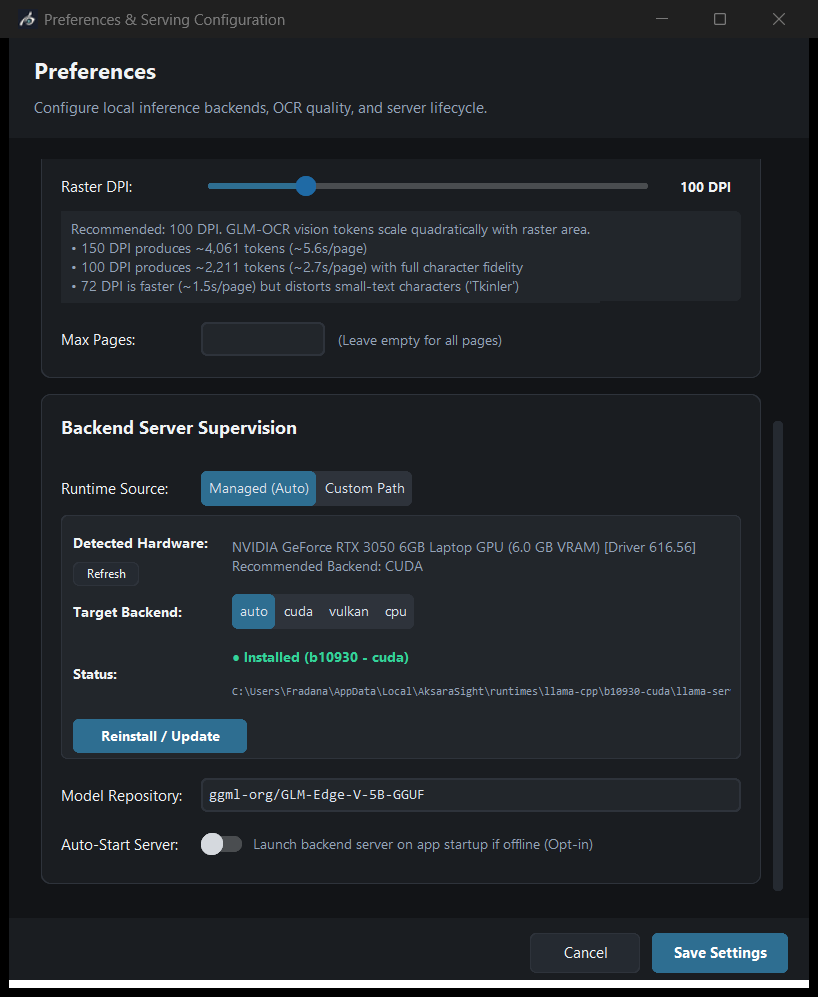

# AksaraSight

[](https://github.com/afif25fradana/AksaraSight/actions/workflows/tests.yml)

AksaraSight is a desktop app for running OCR locally on your computer. It takes scanned documents, PDFs, receipts, or images and converts them into Markdown, Word documents (.docx), or structured JSON.

I built this because most modern OCR tools require uploading files to third-party cloud APIs. If you are scanning tax papers, legal contracts, medical records, or personal notes, sending them off to a remote server is often unacceptable. AksaraSight runs entirely offline using the GLM-OCR model and llama.cpp under the hood. There is no cloud fallback. If the local backend is unreachable, it stops instead of quietly routing your files across the internet.



## What it can do

- **Completely offline**: Everything runs on your machine. Your documents never touch the internet.
- **Export to Word, Markdown, and JSON**: Generates clean `.docx` files with preserved headings and tables, as well as raw `.md` and `.json`.
- **Simple desktop interface**: Drag and drop single files or folders to queue them up. You can view the original scan side-by-side with the extracted text, formatted preview, and JSON output.
- **Built-in runtime setup**: You don't need to manually configure llama.cpp or compile CUDA drivers. The app checks your hardware (NVIDIA GPU, Vulkan, or CPU) and downloads the matching build for you.
- **Command-line interface**: If you prefer terminals or want to script batch conversions, you can use the CLI directly.

## Getting Started

### Option 1: Portable Windows Build (No Python needed)

The easiest way to run AksaraSight on Windows:

1. Go to the [Releases](https://github.com/afif25fradana/AksaraSight/releases) page.
2. Download `AksaraSight-v1.2.1-windows-x64.zip`.
3. Extract the zip anywhere and double-click `AksaraSight.exe`.

### Option 2: Running from source

If you prefer running from source or want to inspect the code:

Requirements: Windows 10/11 and Python 3.12+ (tested on Python 3.12 & 3.14; 3.14 recommended).

```powershell
git clone https://github.com/afif25fradana/AksaraSight
cd AksaraSight
python -m venv .venv
.\.venv\Scripts\Activate.ps1
pip install -r requirements.txt
python -m gui
```

## First run walkthrough

1. Open the application (`AksaraSight.exe` or `python -m gui`).
2. Click the **Preferences** button in the top-right header.
3. Under *Local Inference Engine*, click **Download Runtime**. The app will detect your graphics card (or fall back to CPU) and grab the verified server build.

<p align="center">
  
  
</p>

4. Click **Start Server** in the main window header. Once the status shows `READY`, drop a scan or PDF into the drop zone.
5. Check the result in the preview tabs, then click **Export All** to save your files.

## A few things to keep in mind

AksaraSight is a personal open-source project with real-world limitations:

- **Hardware and testing**: I built and tested this entirely on my personal laptop (NVIDIA GeForce RTX 3050 6GB Laptop GPU, 16GB RAM). On first setup, the app downloads the llama.cpp binary and the ~1.4 GB GLM-OCR model. Around 2.2 GB VRAM is recommended for GPU inference; CPU fallback works if you don't have a dedicated GPU, but it is noticeably slower. While the underlying engine includes support for Vulkan as well, I don't own other PCs, laptops, or AMD/Intel graphics cards to test every hardware setup myself. If you run into issues on other hardware, bug reports and feedback are very welcome.
- **Scan quality**: It handles cleanly printed sheets, forms, and receipts well. Heavily skewed photos, bad lighting, crumpled paper, or messy handwriting will likely have transcription mistakes.
- **Speed**: On my laptop with an NVIDIA GPU, processing takes about 2 to 3 seconds per page. On CPU, it works reliably, but it takes noticeably longer.
- **The dollar sign quirk**: GLM-OCR has a known issue where dollar signs placed directly before numbers without a space (e.g. `$100.00`) get interpreted by the model's tokenizer as an unclosed math equation and stripped out, leaving `.00`. If you have financial scans, format amounts with spaces (`$ 100.00`) or ISO codes (`USD 100`), or double-check dollar amounts in your output.
- **Cancellation**: If you cancel a multi-page job while it is processing, it finishes the current page first so you keep whatever pages were already finished.

## Technical documentation

If you are an engineer looking for CLI flags, environment variables, manual server flags, architecture notes, or the test suite:

Check out [TECHNICAL.md](TECHNICAL.md) for the complete technical manual.

## License

MIT License. See [LICENSE](LICENSE) for details.  
GLM-OCR model weights are subject to the upstream GLM license.